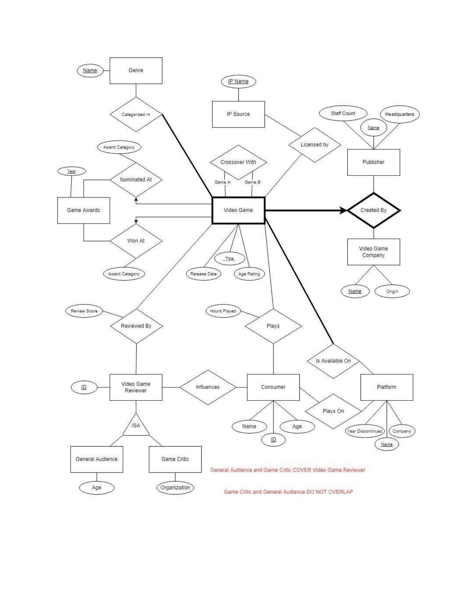
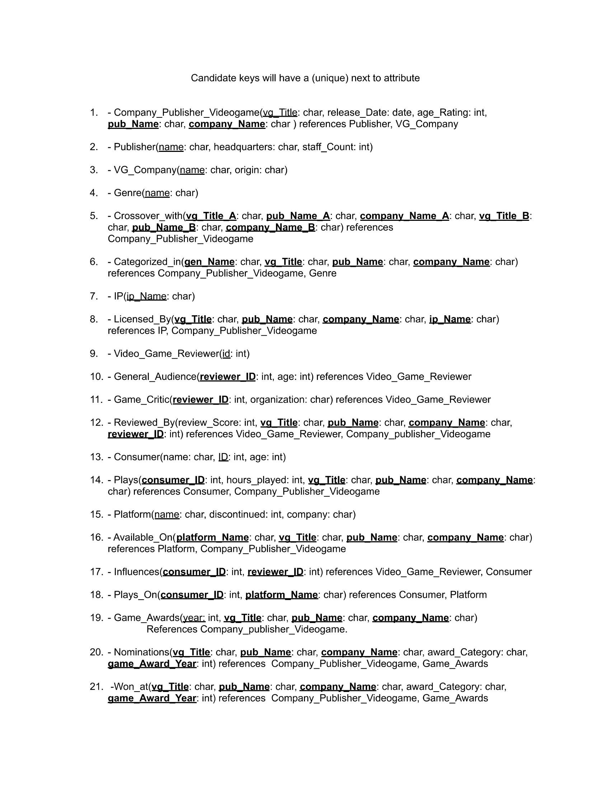
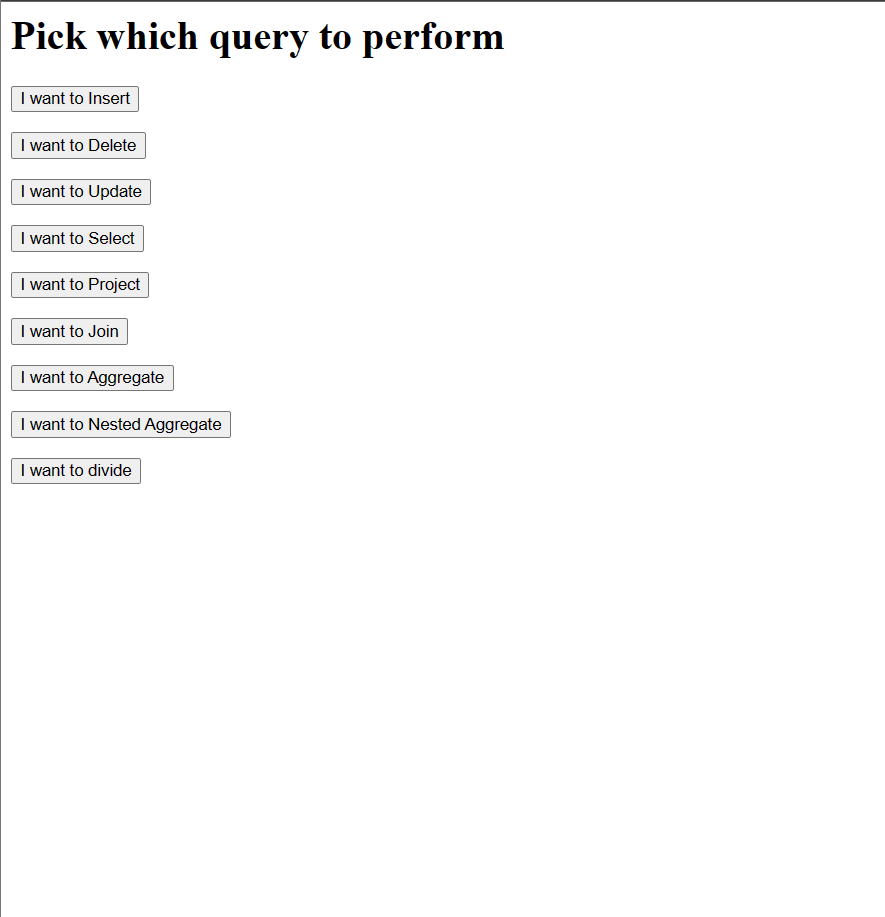
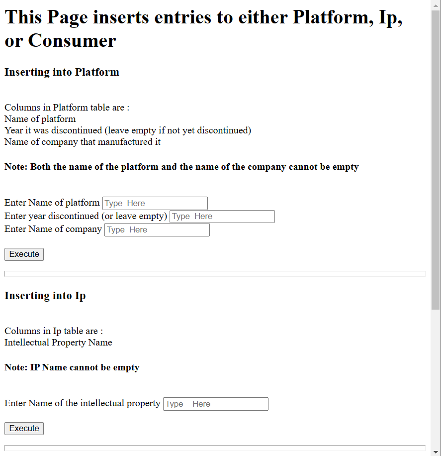
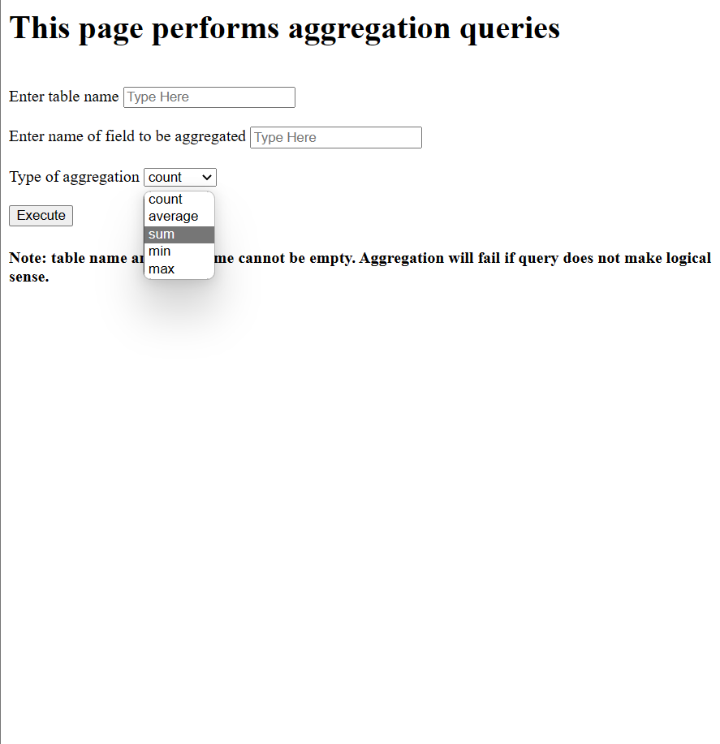

# Videogame-SQL

Videogame-sql is a simple showcase of different MySQL commands such as inserting, prejecting, aggregation, etc. It requires the apache and MySQL services provided by XAMPP. Viewing the database can be done through SQL's admin dashboard. 

The Entity Relationship Diagram along with the Schema of the project is as follows:

#
The relationship between entities is centered around the Video Game entity, and the main.html provides a front page for the user to select which action they want to take. Selecting an option will redirect the user into a webpage to provide further details on the actions that wants to be taken.
The script provided in SQL_Scripts/generate_full contains the SQL commands to create and populate the tables. 

  
  
  
 </0>

# How to Run:

0. Copy the contents of this folder to xampp/htdocs/videogame-sql
1. Open XAMPP
2. Start Apache, then start MySQL
  2.1 If a MySQL shutdown unexpectedly error occurs, open task manager and end the tasks that say mysql
3. Open the config in MySQL
4. Go to new on the sidebar and create database
5. Go to the new database on the sidebar, click SQL
6. copy and paste the contents of Videogame-SQL/SQL_Scripts/generate_full and call the database `videogame-sql`
7. Open main.html by going to localhost/videogame-sql